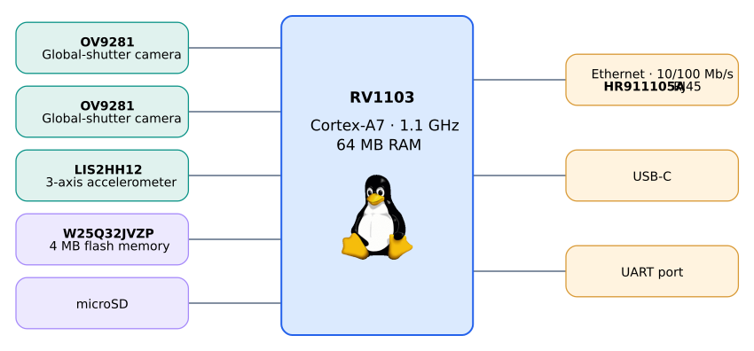

# 4reel
4reel is a platform for robots that don't have enough computing power to run machine vision algorithms. It's capable of stereo depth processing, image classification and SLAM.

When connected over USB-C the device will present itself as an Ethernet adapter and DHCP you an IP address, configuration can be done on the web portal at `http://192.168.77.1:8080/`

The JST connecter can be used to send data UART to an Arduino, ESP32, etc. The same JST conncetor can be used to power the device with 5V.

## System Overview



```sh
python3 scripts/render_overview.py
```


## Repo structure
``` bash
.
|-- img
|-- os
|-- readme.md
|-- ref
|-- rv1103    # Current tested board
|-- rv1106    # Next generation
`-- scripts   # Automation scripts I wrote
```


# Media
- https://youtube.com/shorts/XkLzl0wEfN4?si=KPXePSXCayTTsI1j
