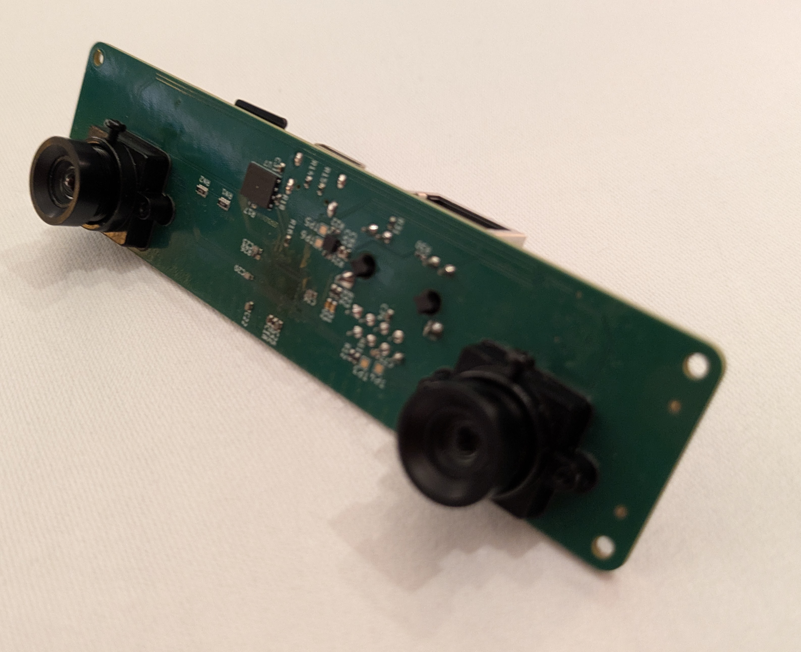

# 4reel

4reel is an open source project baced on the Rockchip RV1103 and 2x camera OV9281 modules. You can use it to do all sorts fo stuff.

# Media
- https://youtube.com/shorts/XkLzl0wEfN4?si=KPXePSXCayTTsI1j

## Repo structure
``` bash
.
|-- img
|-- os
|-- readme.md
|-- ref
|-- rv1103    # Current tested board
|-- rv1106    # Next generation
`-- scripts   # Automation scripts I wrote
```

## Random notes ignore these
- Change hole size to M2.2
- Change SoC to RV1106G3
    - This might need a new PMIC etc
- Power distrobution trace thickness
- LED resistors too large
